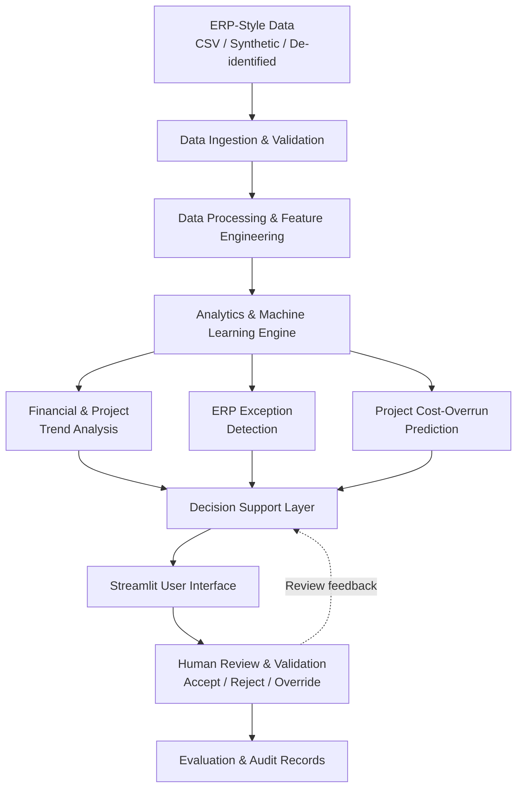

# Architecture Diagram

This directory contains the system architecture diagram for the **AI-Enabled ERP Decision Support** proof of concept.

The diagram illustrates the major system components, data flow, analytics and machine learning processes, decision-support layer, user interface, human review mechanism, and evaluation records.

## System Architecture

The architecture follows a modular design in which analytical and machine learning outputs are presented to human users for review. The system does not make autonomous high-impact decisions.
