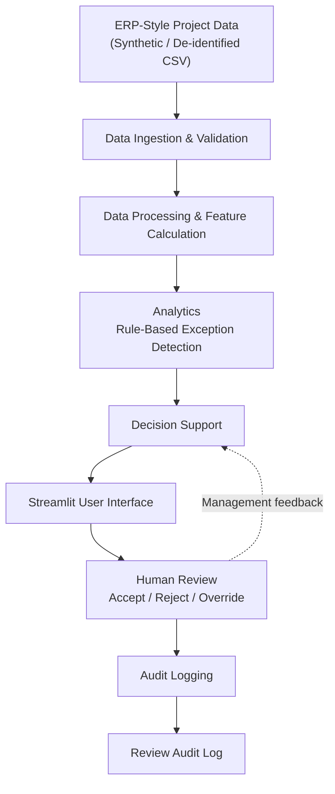
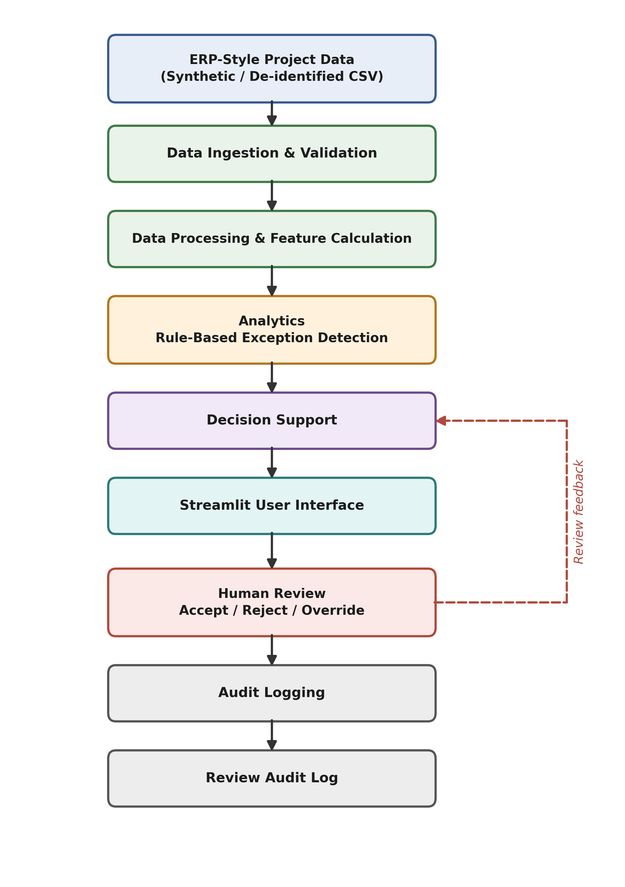

# AI-Enabled ERP Decision Support — System Architecture

## 1. Overview

The AI-Enabled ERP Decision Support prototype is designed as a decision-support system for analyzing synthetic ERP-style project and financial data. The architecture separates data ingestion, processing, analytics, decision support, human review, and audit logging into distinct components.

The system is intentionally designed to support human decision-making rather than make autonomous management decisions. Human reviewers can accept, reject, or override system recommendations, and their decisions are recorded in an audit log.

## 2. Implemented Architecture



### Architecture Diagram

The following diagram provides the visual representation of the implemented system architecture.



## 3. Architecture Components

### 3.1 Data Ingestion and Validation

The data ingestion layer loads ERP-style project data from CSV files and validates the required structure and values before further processing.

The validation component checks for:

* Required columns
* Empty datasets
* Duplicate project identifiers
* Numeric financial and progress fields
* Valid budget and actual-cost values
* Progress percentages within the expected 0–100 range

Implementation:

```text
src/data_ingestion/loader.py
```

The current prototype uses synthetic ERP-style data:

```text
data/synthetic/erp_project_data.csv
```

No confidential production ERP data is used.

### 3.2 Data Processing and Feature Calculation

After validation, the data processing layer calculates derived project performance indicators.

The implemented metrics include:

* Budget variance
* Budget utilization percentage
* Committed cost percentage
* Progress gap
* Cost-to-progress ratio

These metrics provide a consistent analytical basis for subsequent exception detection and decision support.

Implementation:

```text
src/data_processing/processor.py
```

### 3.3 Analytics and Exception Detection

The analytics layer currently implements transparent, rule-based exception detection.

The system evaluates:

1. Budget utilization
2. Progress against planned progress
3. Cost relative to project progress

When configured thresholds are exceeded, the system flags the project and records the corresponding exception reason.

Implementation:

```text
src/analytics/exception_detection.py
```

The current prototype therefore does **not** claim that the exception detector itself is a machine-learning model. The rule-based approach provides explainable and deterministic results suitable for this proof of concept.

### 3.4 Decision Support

The decision-support layer presents exception information to support management review.

The system provides the reviewer with:

* Project identification
* System recommendation
* Exception reasons
* Supporting project metrics
* Human review actions

Implementation:

```text
src/decision_support/review.py
```

The recommendation is intended to support, rather than replace, human judgment.

### 3.5 Streamlit User Interface

The Streamlit application provides the interactive interface through which users can:

* View portfolio-level project metrics
* Compare budget and actual costs
* Compare actual and planned progress
* Filter projects by risk level
* Review detected exceptions
* Examine supporting project metrics
* Record human review decisions
* View the review audit log

Implementation:

```text
src/app.py
```

### 3.6 Human Review and Validation

Human oversight is a core architectural principle of the prototype.

For each exception requiring review, the reviewer can select one of three actions:

```text
Accept
Reject
Override
```

A reviewer comment is required for each decision.

This allows a human reviewer to challenge the system recommendation and document the reasoning behind the final management decision.

The design prevents the prototype from treating the rule-based recommendation as an automatic management decision.

### 3.7 Audit Logging

Human review decisions are recorded in a persistent audit log.

Each record contains:

* Timestamp
* Project ID
* Reviewer
* System recommendation
* Review action
* Reviewer comment

Implementation:

```text
src/audit/audit_log.py
```

Current storage:

```text
data/audit/review_audit_log.csv
```

For a production implementation, the local CSV could be replaced by a controlled database or secure audit-storage mechanism with appropriate access controls, retention, and integrity protections.

## 4. Human-in-the-Loop Decision Flow

The human-in-the-loop design is represented as:

```text
Exception Detected
       |
       v
System Recommendation
       |
       v
Human Reviewer
   /      |       \
  /       |        \
Accept   Reject   Override
  \       |        /
   \      |       /
    v     v      v
Documented Review Decision
       |
       v
Audit Log
```

The human reviewer remains responsible for evaluating the available evidence and determining the appropriate management response.

The audit record provides traceability between the system recommendation and the human decision.

## 5. Design Principles

The implemented architecture follows several key principles.

### Explainability

The exception detector records the specific rule or rules that caused an exception to be identified. This allows reviewers to understand why a project was selected for review.

### Human Oversight

The system does not automatically execute a management action based on an exception. A human reviewer must evaluate the recommendation.

### Accountability

Review actions require a reviewer identity and comment. This establishes responsibility for the recorded decision.

### Auditability

Review decisions are persisted with timestamps, project identifiers, recommendations, actions, and reviewer comments.

### Separation of Responsibilities

The system separates ingestion, processing, analytics, decision support, user interaction, and audit functions into distinct modules.

### Data Minimization

The prototype uses synthetic ERP-style data and does not require confidential production ERP data.

## 6. Current Prototype Scope and Future Extension

The current implementation is a proof of concept focused on project and financial analysis, transparent exception detection, and human-in-the-loop decision support.

Future versions may extend the analytics layer with machine-learning models for use cases such as project cost-overrun prediction. Such models would remain subject to human review, evaluation, explainability requirements, and audit controls.

The current rule-based exception detector should therefore be distinguished from future machine-learning capabilities.

## 7. Implementation Mapping

| Architecture Layer                    | Implementation                                  |
| ------------------------------------- | ----------------------------------------------- |
| Data Ingestion & Validation           | `src/data_ingestion/loader.py`                  |
| Data Processing & Feature Calculation | `src/data_processing/processor.py`              |
| Analytics & Exception Detection       | `src/analytics/exception_detection.py`          |
| Decision Support                      | `src/decision_support/review.py`                |
| Streamlit User Interface              | `src/app.py`                                    |
| Human Review                          | `src/decision_support/review.py` / `src/app.py` |
| Audit Logging                         | `src/audit/audit_log.py`                        |
| Synthetic ERP Data                    | `data/synthetic/erp_project_data.csv`           |
| Review Audit Data                     | `data/audit/review_audit_log.csv`               |
| Automated Tests                       | `tests/`                                        |
